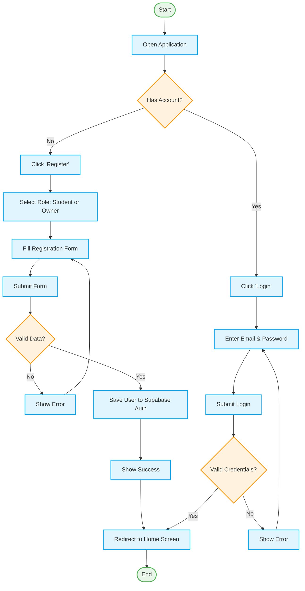
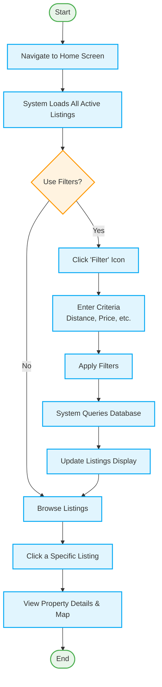
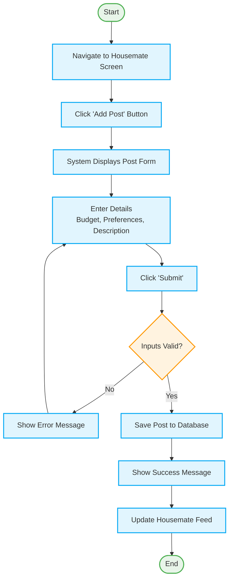
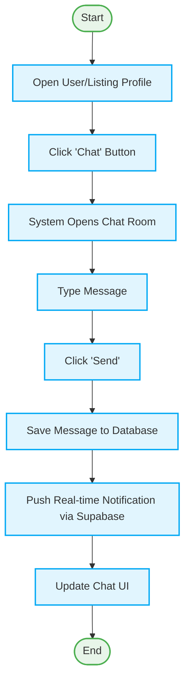
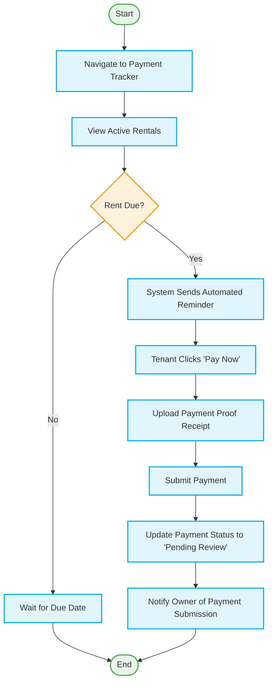

# Activity Diagrams for SewaSiswa

Here are the activity diagrams for all the major processes in your application. You can use these logical flows to draw your diagrams in draw.io or use them directly in your documentation.

## 1. User Authentication (Registration & Login)
This process covers how a user creates a new account (as a Student or Owner) and how they log in.

## 2. Searching & Filtering Properties
This process illustrates how a student searches for properties, applies filters (like distance radius), and views the listing details.

## 3. Posting a Housemate Request
This process shows how a student creates a post looking for a housemate.

## 4. In-App Messaging
This process outlines how a user initiates a chat and sends a message to an owner or another student.

## 5. Rental Payment Management
This process defines the flow for a tenant being reminded to pay rent and submitting their payment proof.

