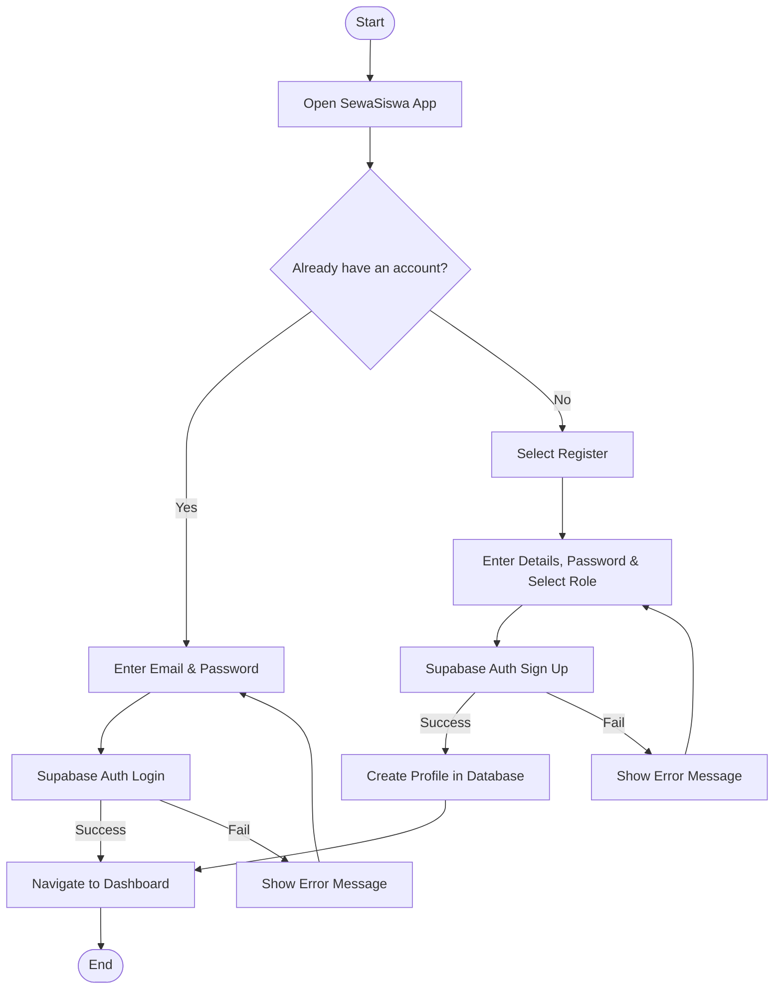
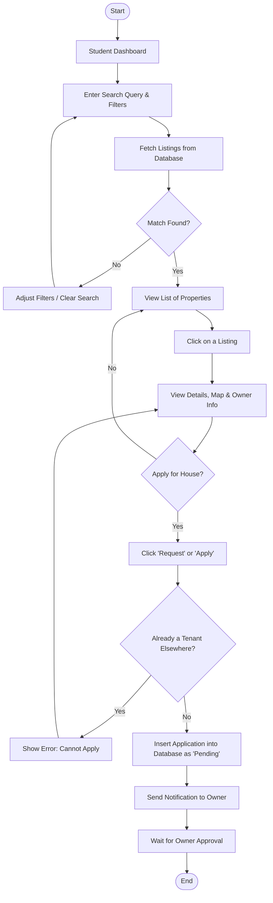
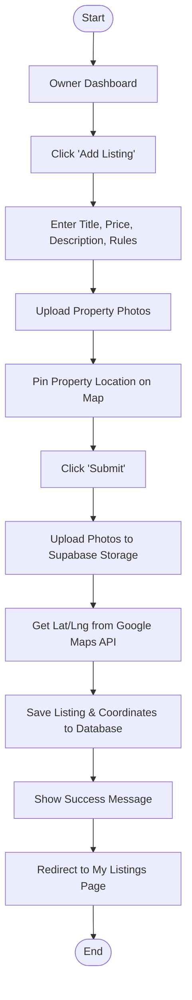
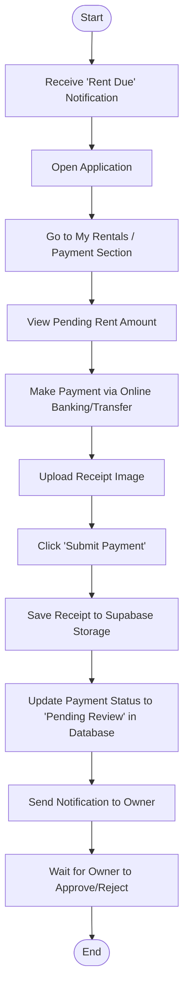

# Flowcharts for SewaSiswa

Here are the Flowcharts detailing the step-by-step logic and decision paths for the main processes in your project. You can copy this Mermaid code directly into draw.io, Mermaid Live, or include it in your FYP markdown report.

## 1. User Registration & Login Flow
This flowchart shows the logic for a user entering the app, deciding to log in or register, and authenticating with Supabase.

## 2. Student Searching & Applying for a Property
This flowchart maps how a student searches for properties, applies filters (like distance or price), and sends an application request.

## 3. Owner Creating a Property Listing
This flowchart explains the process an Owner goes through to publish a new house or room for rent.

## 4. Tenant Submitting Rent Payment
This flowchart shows the flow when a Tenant needs to submit their monthly rent payment proof to the Owner.

