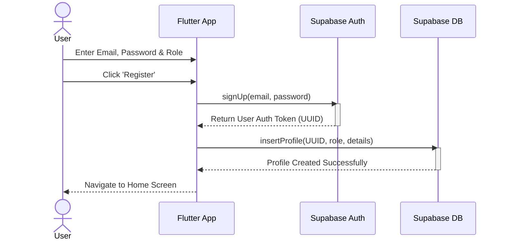
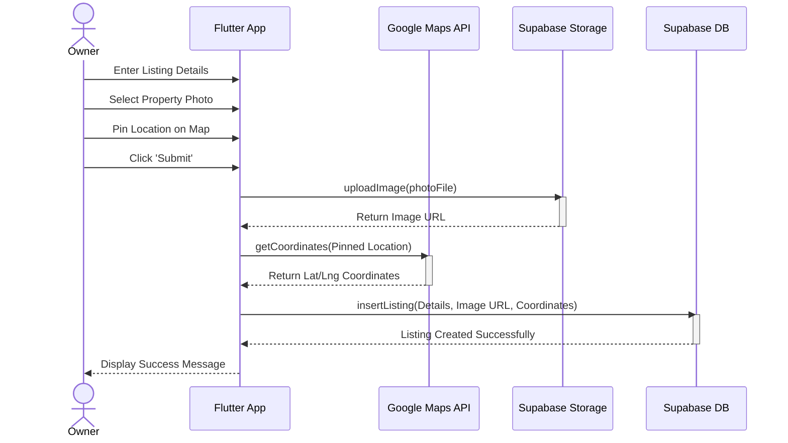
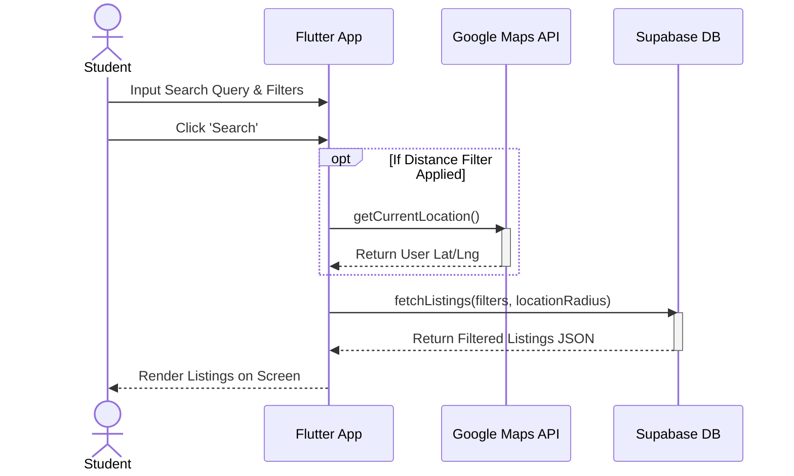
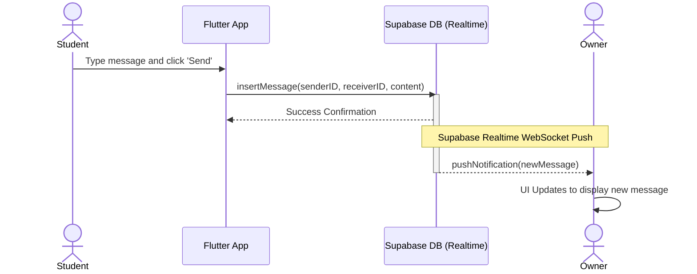
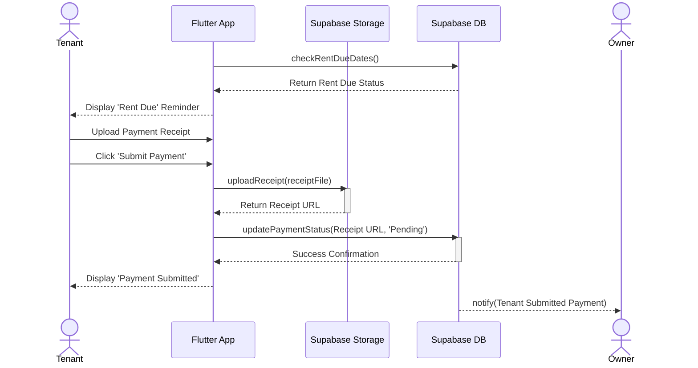

# Sequence Diagrams for SewaSiswa

Here are the Sequence Diagrams mapping out the interactions between the User, the Flutter Application, the Supabase Backend (Auth, Database, Storage), and External APIs (Google Maps) for the main processes in your project. You can copy this code directly into draw.io, Mermaid Live, or include it directly in your FYP markdown report.

## 1. User Registration (Student or Owner)
This diagram shows the sequence of events when a new user registers on the platform.

## 2. Posting a Property Listing
This diagram maps out how an Owner creates a listing, uploads an image, and fetches location data.

## 3. Searching & Filtering Properties
This diagram details how a student searches for properties and applies distance/price filters.

## 4. In-App Messaging (Realtime)
This diagram outlines the real-time communication flow when a Student messages an Owner.

## 5. Rental Payment Submission
This diagram shows how a Tenant uploads a rent payment receipt for the Owner to review.

